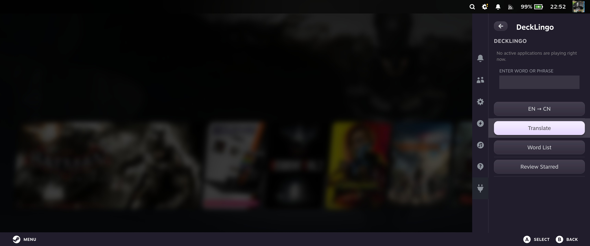

# Decklingo 🌐


A [Decky Loader](https://decky.xyz) plugin for Steam Deck or other SteamOS devices that helps you translate and save words while gaming.

When you encounter a word or phrase in a game that you don't understand, open Decklingo, type it in, get an instant EN↔CN translation, and save it to your personal word list — organized by game automatically.

No API key needed. Just install and use.



## Features

- **EN ↔ CN Translation** — powered by DeepL, no setup required
- **Auto game detection** — automatically detects the currently running game
- **Save words per game** — words are organized by game automatically
- **Word List** — browse all saved words for the current game
- **Star / Review** — star important words and review them later
- **No configuration needed** — just install and translate

### Requirements

- Steam Deck (LCD or OLED) or Legion Go S SteamOS
- [Decky Loader](https://decky.xyz) installed on your Steam Deck
- Internet connection for web-based text recognition and translation services

## Installation

### From Decky Plugin Store
1. Install [Decky Loader](https://github.com/SteamDeckHomebrew/decky-loader/tree/main?tab=readme-ov-file#-installation) on your Steam Deck
2. Open (...) side bar and move down to Decky menu
3. Select **store** icon to view all the available plugins
4. Search for "Decklingo" and install it

## How to use it?

1. Launch a game on your Steam Deck
2. Press the `...` button to open the Quick Access Menu
3. Open Decklingo
4. Type a word or phrase
5. Toggle CN→EN or EN→CN
6. Hit **Translate**
7. Hit **Save Word** to save it to your game's word list
8. Go to **Word List** to browse saved words — tap to star/unstar (more features coming up!)
9. Go to **Review Starred** to study your favorited words 

## For Developers

If you want to build from source:

```bash
git clone https://github.com/Yhangzzz12/decklingo
cd decklingo
pnpm i
pnpm run build
```

## Tech Stack

- **Frontend**: React + TypeScript (Decky plugin)
- **Backend**: Python
- **Translation**: DeepL API via proxy server
- **Storage**: JSON file on device

## License

BSD-3-Clause — see [LICENSE](LICENSE) for details.

## Author

Made by [@Yhangzzz12](https://github.com/Yhangzzz12)

## Acknowledgements

- [Valve](https://www.valvesoftware.com/) for creating the Steam Deck - a beautiful device that makes projects like this possible
- [Decky Loader](https://github.com/SteamDeckHomebrew/decky-loader) team for the plugin framework
- [Steam Deck Homebrew](https://github.com/SteamDeckHomebrew) community for their amazing plugins, which served as a great reference while building this one
- [Deepl Translation](https://www.deepl.com/en/translator) For Translation API


